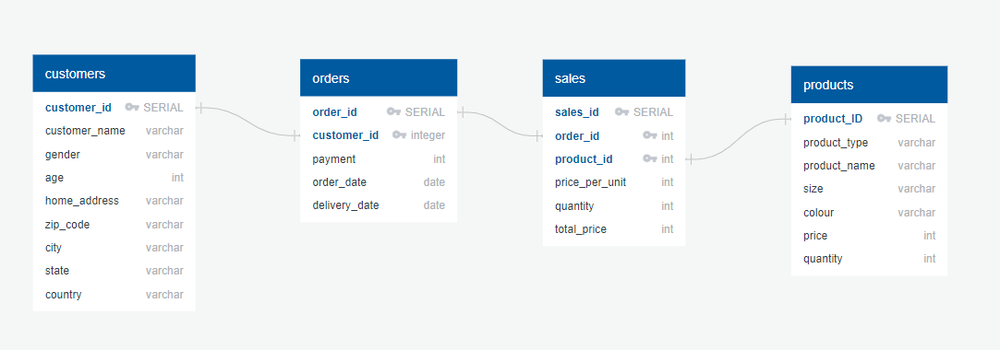
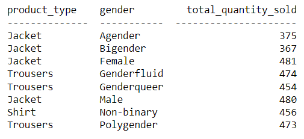

# Sales Analysis

## Project Overview

This project will analyze retail sales, including product types, customer details, count of orders, etc. This topic was selected by group consensus that sales was an interesting topic and has the ability to be predictable and forecasted. When examining sales, the dataset may suggest that certain products are more susceptible to lower sales. Retail sales are broad enough to leverage many processes such as SQL, Python, API lines, ETL, and much more; which ultimately allowed for a free range of manipulating the dataset to further the study. With many variables, product types, product colors, count of products purchased, and customer details. The dataset is largely available for the exploration of many questions and hypotheses.

In today's highly competitive market, businesses need to have a comprehensive understanding of their customers, sales trends, and product performance to remain successful. The goal of this project is to analyze e-commerce sales data using various analytical techniques and tools to gain insights into customer behavior, sales trends, and revenue generation. Furthermore, the insights gained from this project will help the online businesses identify their top-performing products, target their marketing efforts more effectively, and optimize their sales strategies to increase revenue and customer satisfaction.

## Objectives

1. Analyze the customer behavior and trends.
2. Determine the popular products and categories.
3. Identify the revenue generation patterns and trends.
4. Create predictive models to forecast future sales, customer churn, and customer lifetime value.

## Methodology

- **Data Exploration:** Explore the customer orders and sales data to identify any patterns, trends, or outliers that may be useful for analysis using Python and SQL.
- **Data Cleaning:** Clean and preprocess the data, including handling missing or invalid values, converting data types, and merging tables as needed using Python and SQL.
- **Data Analysis:** Conduct exploratory data analysis and perform statistical analysis to identify key insights and trends in the data using Python and SQL.
- **Predictive Modeling:** Build predictive models using regression, clustering, and other machine learning techniques to forecast future sales, customer churn, and customer lifetime value using Python and SQL.
- **Visualization:** Use Tableau to create interactive and dynamic visualizations that effectively communicate key findings and insights from the data analysis and predictive modeling.
- **Reporting:** Compile a comprehensive report summarizing the data analysis and predictive modeling results, including key insights, conclusions, and recommendations for future actions.

## Roles

- Ana: Project Manager/Data Analyst 
- Diana: Tableau Developer
- Katelin: Data Analyst
- Natalia: Data Scientist

## Role Description 

- **Data Analyst:** This person will be responsible for exploring and analyzing the customer orders and sales data to identify any patterns, trends, or outliers that may be useful for analysis. They will also clean and preprocess the data, including handling missing or invalid values, converting data types, and merging tables as needed. The Data Analyst will use programming languages such as Python and SQL to conduct exploratory data analysis and perform statistical analysis. They will collaborate with the other team members to identify key insights and trends in the data and provide recommendations based on their findings.

- **Data Scientist:** This person will be responsible for building predictive models using regression, clustering, and other machine learning techniques to forecast future sales, customer churn, and customer lifetime value. She will use programming languages such as Python and R to develop these models and test their accuracy. The Data Scientist will collaborate with the Data Analyst to ensure that the data is clean and properly prepared for modeling. She will also work closely with the Tableau Developer to create interactive visualizations that effectively communicate the results of the predictive modeling.

- **Tableau Developer:** This person will be responsible for creating interactive and dynamic visualizations using Tableau that effectively communicate key findings and insights from the data analysis and predictive modeling. They will work closely with the Data Analyst and Data Scientist to identify the most important insights to communicate and the best way to display them. The Tableau Developer will also create a dashboard that provides a comprehensive overview of the data analysis and predictive modeling results.

- **Project Manager:** This person will be responsible for managing the overall project and ensuring that it is completed on time. She will work closely with all team members to ensure that each person's role is clearly defined and that everyone is meeting their deadlines. The Project Manager will also communicate with stakeholders to provide regular updates on the project's progress and ensure that their needs are being met.

## Project Phases

### 1. Data Collection 

Source of the data: https://www.kaggle.com/datasets/ruchi798/shopping-cart-database. 

The dataset contains four CSV files containing sales details for the 12 months of the year 2021.  Each file contains anywhere from 1000 to 5001  rows and 5-9  columns. The columns are as follows: customer id, customer name, gender, age, home address, zip code, city, state , country, order id, payment, order date, delivery date, sales id, product id, price per unite, quantity, total price, product type, product name, size, color, price, quantity.

### 2. Data Exploration

### Data Description

One important step in completing the project is to describe the data. Understanding the nature of the data will help team members determine the types of analysis that can be performed.

The dataset chosen for this project - Sales - was retrieved from https://www.kaggle.com/datasets/ruchi798/shopping-cart-database. It includes four tables containing sales details for the 12 months of 2021.

**Customers Information**

**Order Details**

**Product Information**

**Sales Transactions**

### Demographic Information

To provide a comprehensive description of the data, the team used the "describe" function in a Jupyter notebook file. The analysis revealed several key aspects related to customers and orders:

- On average, customers were found to be 49.86 years old.
- The youngest customer to have made a purchase was 20 years old.
- The oldest customer was found to be 80 years old.
- The dataset included a total of 1000 orders.

Furthermore, the team analyzed the products and sales CSV files using the "describe" function in a Jupyter Notebook file. The findings are as follows:

- The average amount spent on a single product was found to be $103.50.
- Average price of products is $105.81
- The highest-priced product offered by the company was priced at $119.00.
- The least expensive product sold had a price of $90.00.
- The data indicated that no customer had purchased more than three items.
- The most popular item sold was purchased 80 times.
- Range of order dates was 2021-1-1 to 2021-9-9
- Range of prices per unit: $90.00-$119.00
- Range of quantities sold in sales data set: 1-3
- Average quantity of products sold per order: 1.99
- Most common product type in the product info data set:  Jacket

By analyzing this data, we can answer a variety of business-related questions and make informed decisions to improve sales performance. This goal will be achieved by using several programming languages and tools, including SQL, Python, R, and Tableau, to extract, clean, transform, and visualize the data. 

### Data Cleaning with Python 

To clean the data, we followed a systematic process that involved several steps. First, we assessed the data to identify any issues, such as missing values, duplicates, or errors. We then decided on a strategy for handling each of these issues.

For instance, if we found missing values, we might have chosen to impute them using statistical methods, such as mean or median imputation, or we might have dropped the affected rows. If we discovered duplicates, we might have removed them by keeping only the first occurrence of each record or by aggregating the data.

We also checked for inconsistent or incorrect data types, such as strings in numerical fields, and converted them to the appropriate data type. Additionally, we looked for outliers and decided whether to remove them or keep them depending on their significance to the analysis.

After applying these cleaning strategies, we verified the data to ensure that it was free from errors and inconsistencies. We ran data quality checks, such as checking for missing values, duplicates, and outliers. If any issues were still present, we revisited the cleaning process until the data met the desired quality standards.

**Python Tools used for Data Cleaning**

- **Jupyter Notebook:** To write and execute the Python code.

- **Pandas:** To perform data manipulation and analysis.

- **Matplotlib:** To create visualizations and plots for better understanding and analysis.

### ERD

We created an ERD using QuickDBD

## Data Analysis

**Sales Trend Over Months**

- The month with the highest sales was March with a total of $131,364.00
- The month with the lowest sales was October with a total of $84,266.00

**What are the most profitable product types and sizes among our customers?**

**What are the products with the highest and lowest sales? What are the best selling products?**

- **Product with the highest sales:**

*Denim*

Total quantity sold: 527

- **Product with the lowest sales:**

*Mandarin Collar*

Total quantity sold: 236

**Which gender has the highest total quantity sold?"**

- Gender with the highest total quantity sold overall: Female

**What are the top selling products by gender?**

- The mean quantity sold across all genders is 2.048594, which indicates that on average, 2 products are sold per purchase.
- The median quantity sold is 2, which suggests that half of the purchases consist of 2 products.
- The mode quantity sold is mostly 1 or 2 products, with some exceptions.
- The standard deviation of the quantity sold is 0.889753, indicating that there is some variability in the amount of products sold per purchase.

**How does the quantity sold vary across different age groups? Are there any trends or patterns in the quantity sold by age group?**

- The average age of customers in the dataset is approximately 48.8 years.
- The average quantity sold per transaction is approximately 2.05 units.
- The standard deviation of the quantity sold is 0.89 units, indicating that there is relatively low variability in the amount sold.
- The minimum age in the dataset is 20 years old and the minimum quantity sold is 1 unit.
- 25% of customers are under 34 years old and purchased 1 unit.
- 50% of customers are between 34 and 63 years old and purchased 2 units.
- 75% of customers are over 63 years old and purchased 3 units.
- The maximum age in the dataset is 80 years old and the maximum quantity sold is 8 units.

# Predictions

## Model 1: ARIMA Sales Forecasting Model

- **What are the forecasted sales for the next four months for each product?**

## Model Description

This sales forecast was created using an ARIMA (Autoregressive Integrated Moving Average) model. The model is fitted to the historical sales data for each product type to identify patterns in the data and to forecast future sales. The ARIMA model is a type of time series model that takes into account the past values and errors in the data to make predictions. The order of the model, specified as (1,1,1), represents the number of autoregressive, differencing, and moving average terms used in the model. Autoregressive terms capture the relationship between the current value and the previous values, while the moving average terms capture the relationship between the errors and their previous values. The differencing term is used to remove any trend or seasonality present in the data. The forecasted values obtained from the ARIMA model are then stored in the forecast key of the corresponding product's dictionary and printed for each product type.

## Results

1. The ARIMA forecast model predicted that Jacket sales will increase steadily over the next 4 months from 7 to 10 units, with sales figures of approximately 7, 8, 9, and 10.
2. The ARIMA forecast model predicted that Shirt sales will increase steadily over the next 4 months from 7 to 10 units, with sales figures of approximately 7, 8, 9, and 10.
3. The ARIMA forecast model predicted that Trousers sales will increase steadily over the next 4 months from 7 to 10 units, with sales figures of approximately 7, 8, 9, and 10.

## Model 2: Predict the top-selling product types in the next quarter.

## Model Description

This prediction model was built using a linear regression algorithm in Python. The dataset includes three product types - Trousers, Shirt, and Jacket, along with their corresponding total quantities. The dataset was split into a training set and a test set using the train_test_split function from scikit-learn. The training set was then transformed into a sparse matrix of token counts using the CountVectorizer function. The LinearRegression function from scikit-learn was used to train the model on the transformed training set. The trained model was then used to make predictions on the test set. The mean squared error was calculated using the mean_squared_error function from scikit-learn. Finally, new data was provided to the model for prediction, and the output was displayed. The model predicts the total quantity of each product type for the next quarter.

## Problems Found

We could not detect seasonality in this data set (i.e., whether there are certain months of the year when sales are consistently higher or lower). The seasonal_decompose function requires at least two full seasonal cycles to properly decompose the time series. Since we use monthly data, a seasonal cycle would be 12 months, so we would need at least 24 months of data. In this case, we only have 10 months of data, which is not enough to perform the seasonal decomposition. Therefore, we cannot analyze the seasonality of the sales data with this particular dataset. We would need to gather more data over a longer period of time to perform this analysis.

