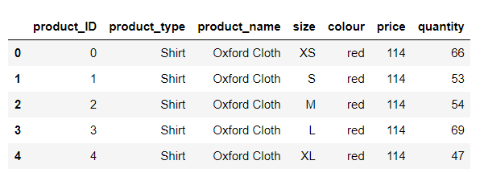
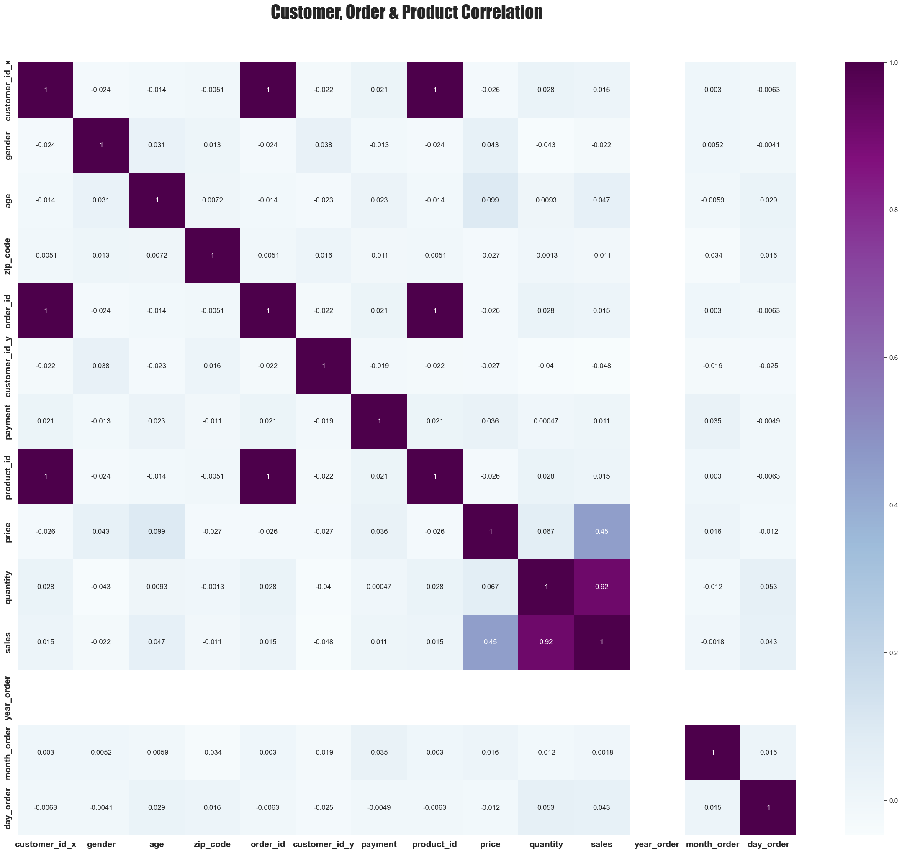
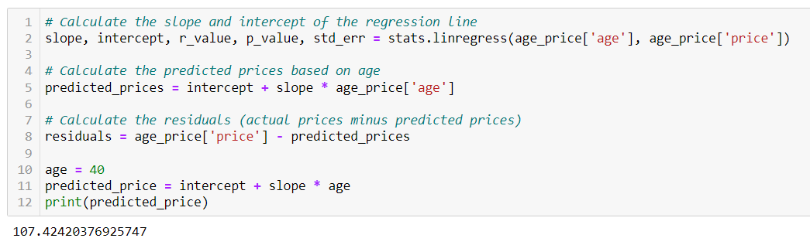

# Sales Analysis

## Edits by Katelin
## Project Overview

This analysis will examine online sales from a retail store based in Australia. We have used variables such as product type, product size, gender, and location to better understand what impacts the stores total revenue. We utilized tools to extract the data from its source, clean the data to prepare for analysis and predictions, in hopes to visually report the stores KPI's to their upper-management team.

This topic was selected by group consensus that sales was an interesting topic and has the ability to be predictable and forecasted. When examining sales, the dataset may suggest that certain products are more susceptible to lower sales. Retail sales are broad enough to leverage many processes such as SQL, Python, API lines, ETL, and much more; which ultimately allowed for a free range of manipulating the dataset to further the study. With many variables, product types, product colors, count of products purchased, and customer details. The dataset is largely available for the exploration of many questions and hypotheses.

In today's highly competitive market, businesses need to have a comprehensive understanding of their customers, sales trends, and product performance to remain successful. The goal of this project is to analyze e-commerce sales data using various analytical techniques and tools to gain insights into customer behavior, sales trends, and revenue generation. Furthermore, the insights gained from this project will help the online businesses identify their top-performing products, target their marketing efforts more effectively, and optimize their sales strategies to increase revenue and customer satisfaction.

## Question

- What is the correlation between customer buying behavior and company revenue? 

## Goal 

- Increase company revenue through understanding customer purchasing behavior and identifying factors that influence this relationship. Develop strategies to forecast and enhance sales based on this understanding.

## Null Hypothesis

- Customer purchasing behavior is not related to company revenue, and there are no factors that influence this relationship.

## Alternative Hypothesis 

- Customer purchasing behavior is related to company revenue, and there are several factors that influence this relationship, including pricing and customer demographics.

## Objectives

1. Describe customer demographics and sales statistics.
2. Determine the popular products and categories.
3. Identify the revenue generation patterns and trends.
4. Create predictive models to forecast future sales.

## Methodology

- **Data Exploration:** Explore the customer orders and sales data to identify any patterns, trends, or outliers that may be useful for analysis using Python and SQL.
- **Data Cleaning:** Clean and preprocess the data, including handling missing or invalid values, converting data types, and merging tables as needed using Python and SQL.
- **Data Analysis:** Conduct exploratory data analysis and perform statistical analysis to identify key insights and trends in the data using Python and SQL.
- **Predictive Modeling:** Build predictive models using regression, clustering, and other machine learning techniques to forecast future sales, customer churn, and customer lifetime value using Python and SQL.
- **Visualization:** Use Tableau to create interactive and dynamic visualizations that effectively communicate key findings and insights from the data analysis and predictive modeling.
- **Reporting:** Compile a comprehensive report summarizing the data analysis and predictive modeling results, including key insights, conclusions, and recommendations for future actions.

## Roles

- Ana: Project Manager/Data Analyst 
- Diana: Tableau Developer
- Katelin: Data Analyst
- Natalia: Data Scientist

## Role Description 

- **Data Analyst:** This person will be responsible for exploring and analyzing the customer orders and sales data to identify any patterns, trends, or outliers that may be useful for analysis. They will also clean and preprocess the data, including handling missing or invalid values, converting data types, and merging tables as needed. The Data Analyst will use programming languages such as Python and SQL to conduct exploratory data analysis and perform statistical analysis. They will collaborate with the other team members to identify key insights and trends in the data and provide recommendations based on their findings.

- **Data Scientist:** This person will be responsible for building predictive models using regression, clustering, and other machine learning techniques to forecast future sales, customer churn, and customer lifetime value. She will use programming languages such as Python and R to develop these models and test their accuracy. The Data Scientist will collaborate with the Data Analyst to ensure that the data is clean and properly prepared for modeling. She will also work closely with the Tableau Developer to create interactive visualizations that effectively communicate the results of the predictive modeling.

- **Tableau Developer:** This person will be responsible for creating interactive and dynamic visualizations using Tableau that effectively communicate key findings and insights from the data analysis and predictive modeling. They will work closely with the Data Analyst and Data Scientist to identify the most important insights to communicate and the best way to display them. The Tableau Developer will also create a dashboard that provides a comprehensive overview of the data analysis and predictive modeling results.

- **Project Manager:** This person will be responsible for managing the overall project and ensuring that it is completed on time. She will work closely with all team members to ensure that each person's role is clearly defined and that everyone is meeting their deadlines. The Project Manager will also communicate with stakeholders to provide regular updates on the project's progress and ensure that their needs are being met.

## Project Phases: ETL

### 1. Data Extraction

Source of the data: https://www.kaggle.com/datasets/ruchi798/shopping-cart-database. 

The dataset contains four CSV files containing sales details for the 12 months of the year 2021.  Each file contains anywhere from 1000 to 5001  rows and 5-9  columns. The columns are as follows: customer id, customer name, gender, age, home address, zip code, city, state , country, order id, payment, order date, delivery date, sales id, product id, price per unite, quantity, total price, product type, product name, size, color, price, quantity.

### 2. Data Transformation

### Data Cleaning with Python 

To clean the data, we followed a systematic process that involved several steps. First, we assessed the data to identify any issues, such as missing values, duplicates, or errors. We then decided on a strategy for handling each of these issues.

For instance, if we found missing values, we might have chosen to impute them using statistical methods, such as mean or median imputation, or we might have dropped the affected rows. If we discovered duplicates, we might have removed them by keeping only the first occurrence of each record or by aggregating the data.

We also checked for inconsistent or incorrect data types, such as strings in numerical fields, and converted them to the appropriate data type. Additionally, we looked for outliers and decided whether to remove them or keep them depending on their significance to the analysis.

After applying these cleaning strategies, we verified the data to ensure that it was free from errors and inconsistencies. We ran data quality checks, such as checking for missing values, duplicates, and outliers. If any issues were still present, we revisited the cleaning process until the data met the desired quality standards.

**Python Tools used for Data Cleaning**

- **Jupyter Notebook:** To write and execute the Python code.

- **Pandas:** To perform data manipulation and analysis.

- **Matplotlib:** To create visualizations and plots for better understanding and analysis.

### ERD

We created an ERD using QuickDBD

### Data Description (Edits by Diana)

One important step in completing the project is to describe the data. Understanding the nature of the data will help team members determine the types of analysis that can be performed.

The dataset chosen for this project - Sales - was retrieved from https://www.kaggle.com/datasets/ruchi798/shopping-cart-database. It includes four tables containing sales details for the 12 months of 2021.

**Customers Information**

**Order Details**

**Product Information**

**Sales Transactions**

### Demographic Information

To provide a comprehensive description of the data, the team used the "describe" function in a Jupyter notebook file. The analysis revealed several key aspects related to customers and orders:

- On average, customers were found to be 49.86 years old.
- The youngest customer to have made a purchase was 20 years old.
- The oldest customer was found to be 80 years old.
- The dataset included a total of 1000 orders.

Furthermore, the team analyzed the products and sales CSV files using the "describe" function in a Jupyter Notebook file. The findings are as follows:

- The average amount spent on a single product was found to be $103.50.
- Average price of products is $105.81
- The highest-priced product offered by the company was priced at $119.00.
- The least expensive product sold had a price of $90.00.
- The data indicated that no customer had purchased more than three items.
- The most popular item sold was purchased 80 times.
- Range of order dates was 2021-1-1 to 2021-9-9
- Range of prices per unit: $90.00-$119.00
- Range of quantities sold in sales data set: 1-3
- Average quantity of products sold per order: 1.99
- Most common product type in the product info data set:  Jacket

By analyzing this data, we can answer a variety of business-related questions and make informed decisions to improve sales performance. This goal will be achieved by using several programming languages and tools, including SQL, Python, R, and Tableau, to extract, clean, transform, and visualize the data. 

## Data Analysis (Edits by Ana)

**Sales Trend Over Months**

- The month with the highest sales was March with a total of $131,364.00
- The month with the lowest sales was October with a total of $84,266.00

- The total sales of all three product types increased from February to March, and then decreased from March to April.

- Among the three product types, Jacket had the highest sales in the first and sixth months, whereas Shirt had the highest sales in the fourth and eighth months, and Trousers had the highest sales in the seventh month.

- Trousers had the lowest sales in most months, except in the fifth month where Shirt had the lowest sales.

- Overall, Jacket had the highest total sales across the 10 months, followed by Shirt and Trousers.

**What is the average quantity of products sold by age group?**

- Customers in the 41-50 year old age group tend to purchase the largest quantity of products on average, with an average quantity sold of 61.7.
- Customers in the 0-30 year old age group tend to purchase the smallest quantity of products on average, with an average quantity sold of 57.5.
- The average quantity sold is relatively similar for customers in the 31-60 year old age groups, ranging from 59.5 to 61.7 on average.
- Customers in the 61-70 year old age group tend to purchase a slightly lower quantity of products on average compared to the other age groups, with an average quantity sold of 59.5.
- There is a general trend of decreasing average quantity sold as age increases, with the highest average quantity sold in the youngest age group and the lowest in the oldest age group.
- The difference in average quantity sold between the youngest and oldest age groups is relatively small, with only about a 25% decrease in average quantity sold from the youngest age group to the oldest.
- There is some variability in the average quantity sold within each age group, as seen by the variation in the markers along the line. This suggests that while age may be a useful predictor of quantity sold, there are likely other factors that are influencing customer behavior as well.
- Overall, this plot provides some insight into how quantity sold varies by age group, but additional analysis would be needed to fully understand the drivers of this variation and to identify potential strategies for increasing sales.
- The fact that the average quantities sold are relatively similar across age groups suggests that the products being sold may be appealing to a wide range of customers, regardless of age. However, it's also possible that there are underlying demographic or psychographic differences between the age groups that are influencing their purchasing behavior.

**What are the products with the highest and lowest sales? What are the best selling products?**

- **Product with the highest sales:**

*Denim*

Total quantity sold: 527

- **Product with the lowest sales:**

*Mandarin Collar*

Total quantity sold: 236

## Top 10 Most Purchased Products

- The product name "Denim" has the highest quantity sold, with a total of 4204 units sold.
- The product name "Wool" has the lowest quantity sold, with a total of 1163 units sold.
- The total quantity sold for each product name ranges from 1163 to 4204, indicating a varying level of demand for each product.
- It's possible that the popularity of each product is influenced by factors such as seasonality, fashion trends, and customer preferences.

## Top 10 Most Profitable Products

- Denim is the most profitable product name, with a total revenue of 54,602
- The dataset consisted of 35 unique product names.
- The average total revenue across all product names was 30,050.29, with a standard deviation of 5,111.53.
- The lowest total revenue was 23,387.

## Correlation Matrix

- The diagonal values are all 1s because they represent the correlation between the features and themselves.

- The off-diagonal values represent the correlation between two features. The value ranges from -1 to 1. The closer the value is to 1, the stronger the positive correlation is. Conversely, the closer the value is to -1, the stronger the negative correlation is. A value of 0 indicates no correlation between the two features.

- Looking at the matrix, we can see that there are only a few strong correlations between the features. For instance, the 'customer_id_x', 'order_id', and 'product_id' features are highly positively correlated with each other with a correlation of 1. This suggests that these three features are highly related, and this may be because they are all related to customer purchases.

- Another strong positive correlation exists between 'quantity' and 'sales', with a correlation of 0.918. This suggests that when the quantity of a product increases, so does the sales.

- Other notable correlations include a positive correlation between 'price' and 'age' and 'sales' and 'price'. Additionally, there is a weak positive correlation between 'payment' and 'age', and a weak negative correlation between 'gender' and 'quantity'.

- There is a positive correlation between 'price' and 'age', meaning that as the age increases, so does its price.

- There is also a positive correlation between 'sales' and 'price', meaning that as the price of a product increases, so do its sales.

- There is a weak positive correlation between 'payment' and 'age', meaning that as the age of a buyer increases, so does the amount they pay.

- Finally, there is a weak negative correlation between 'gender' and 'quantity', meaning that as the gender of a buyer becomes more male-dominated, the quantity of products purchased tends to decrease slightly.

## Is there a correlation between sales and age?

- The correlation coefficient between age and sales is 0.12, which indicates a weak positive correlation between age and sales.
- The p-value for the correlation is 0.34, which is greater than the commonly used significance level of 0.05. This means that we fail to reject the null hypothesis that there is no correlation between age and sales.
- The F-value for the regression is 0.93, which is less than 1. This means that the regression model does not explain much of the variation in the data.
- The R-squared value for the regression is 0.02, which means that only 2% of the variability in sales can be explained by age.
- The slope of the regression line is 0.88, which means that on average, for each one unit increase in age, there is an increase of 0.88 units in sales.
- The 95% confidence interval for the slope is (-0.95, 2.71), which means that we are 95% confident that the true slope of the regression line falls within this interval. The interval includes zero, which means that we cannot be confident that there is a significant linear relationship between age and sales.

## Is there a correlation between price and age?

- Correlation coefficient: The correlation coefficient between 'age' and 'price' is approximately 0.413. The correlation coefficient measures the strength and direction of the linear relationship between two variables. A value of 0.413 suggests a moderate positive correlation between 'age' and 'price'. This means that there is a tendency for prices to increase as age increases, but the relationship is not extremely strong.

- P-value: The associated p-value for the correlation coefficient is approximately 0.000938. The p-value represents the probability of obtaining a correlation coefficient as extreme as the observed value (or more extreme) if there were no true correlation in the population. In this case, the p-value is less than 0.05, indicating that the correlation between 'age' and 'price' is statistically significant. This means that it is unlikely to observe a correlation coefficient as large as 0.413 purely due to chance if there were no true correlation between the variables.

- In summary, based on the correlation coefficient and p-value, we can conclude that there is a statistically significant moderate positive correlation between 'age' and 'price'. However, it's important to note that correlation does not imply causation, and there may be other factors influencing the relationship between 'age' and 'price'. Further analysis and consideration of the context are necessary to fully understand the implications of the correlation.

## Linear Regression Model

- R-squared (R-squared = 0.171): The R-squared value indicates that approximately 17.1% of the variation in the 'price' variable can be explained by the linear relationship with the 'age' variable. This means that the linear regression model does not capture a large portion of the variability in the data.

- Adjusted R-squared (Adj. R-squared = 0.157): The adjusted R-squared value takes into account the number of predictors in the model. It indicates that approximately 15.7% of the variation in the 'price' variable can be explained by the 'age' variable while considering the model's degrees of freedom.

- F-statistic (F-statistic = 12.14): The F-statistic tests the overall significance of the linear regression model. The associated p-value (Prob (F-statistic)) of 0.000938 suggests that the model is statistically significant overall. However, it's worth noting that the R-squared value is relatively low, indicating that the model may not fit the data well.

- Coefficients and p-values: The coefficient for the constant term (intercept) is 105.0770, and the coefficient for the 'age' variable is 0.0587. Both coefficients have associated p-values (<0.05), indicating that they are statistically significant. The intercept represents the estimated average 'price' when 'age' is zero, which may or may not be meaningful depending on the context. The coefficient for 'age' suggests that, on average, for each unit increase in 'age', the 'price' increases by 0.0587 units.

- Standard errors and t-statistics: The standard errors associated with the coefficients measure the variability or uncertainty in the estimates. The t-statistics (coef / std err) provide a measure of the coefficient's significance. In this case, both the intercept and 'age' coefficient have t-values greater than 2 in magnitude, indicating their statistical significance.

- Other statistical information: The summary also provides additional information, such as the Log-Likelihood, AIC (Akaike Information Criterion), BIC (Bayesian Information Criterion), Omnibus test, Durbin-Watson statistic, Jarque-Bera test, skewness, kurtosis, and the condition number.

- In summary, the linear regression model suggests a statistically significant relationship between 'age' and 'price', although the model has a relatively low R-squared value. It is important to consider the limitations of the model and further evaluate its assumptions and performance before drawing definitive conclusions.

## Is there a correlation between product type and age?

- There is a negative correlation between 'age' and 'Jacket', with a value of -0.013462. This suggests that as the customers' age increases, the likelihood of them buying jackets decreases slightly.
- There is a weak negative correlation between 'age' and 'Shirt', with a value of -0.003124. This suggests that there is little to no relationship between the customers' age and their likelihood of buying shirts.
- There is a weak positive correlation between 'age' and 'Trousers', with a value of 0.022330. This suggests that as the customers' age increases, the likelihood of them buying trousers also increases slightly.

- For column Jacket:
F-statistic: 7842.13812922, p-value: 0.00000000
R-squared: -0.01346217

- For column Shirt:
F-statistic: 7842.13812922, p-value: 0.00000000
R-squared: -0.00312433

- For column Trousers:
F-statistic: 7927.61725557, p-value: 0.00000000
R-squared: 0.02233025

- The results suggest that there is a statistically significant but weak relationship between the product type and customer age. Specifically, the correlation matrix shows that the product type has a negative correlation with age, meaning that younger customers are more likely to buy jackets and shirts, while older customers are more likely to buy trousers. However, the R-squared values are low, indicating that the relationship is not very strong.

- As a business, we can use this information to better target your marketing efforts and product offerings to different age groups. For example, we might consider promoting jackets and shirts to younger customers and trousers to older customers.

## Is there a correlation between gender and product type?

For column Jacket:
F-statistic: 737.38525926, p-value: 0.00000000
R-squared: -0.03100088

For column Shirt:
F-statistic: 737.38525926, p-value: 0.00000000
R-squared: 0.02093359

For column Trousers:
F-statistic: 1921.96073705, p-value: 0.00000000
R-squared: 0.01355351

- From the correlation matrix, we can see that there is a strong negative correlation between Jacket and Shirt (-0.724138), which means that customers who buy jackets are less likely to buy shirts, and vice versa.

- There is also a weak negative correlation between Jacket and gender (-0.031001), indicating that there is a slightly lower likelihood of males buying jackets compared to females.

- In contrast, there is a weak positive correlation between Trousers and gender (0.013554), suggesting that there is a slightly higher likelihood of males buying trousers compared to females.

- The F-statistic is a measure of the significance of the linear regression model, and in this case, all columns have very low p-values (0.00000000), indicating that the linear regression models are significant and that the relationship between the independent variables and the dependent variable is not due to chance.

- The R-squared values are very low for all columns, suggesting that the independent variables (Jacket, Shirt, Trousers, gender) explain very little of the variation in the dependent variable (price).

## Decision Tree
- Decision tree built in Jupyter notebook using Sklearn (sscikit-learn) library. Opened in VS code using Graphviz (dot) language.
- In this model we separated it into 2 sets: input(age, gender, state) and output(product type) and tested it. Then we measured our data for accuracy by splitting it into training and testing data and allocated 80% of our data for training and 20% for testing. After we tested it we saved the file and opened it in VS code to create a visual representation of our tree. 

- Results: the accuracy is 50-60%, will be better with more data available.

## Summary

- Significant variables that help to target marketing efforts and predict sales:
Age
Gender
Price
Product Type
State

- Older customers tend to buy more expensive products than younger customers. 
- Older customers tend to buy more quantity of products than younger customers. 
- As the gender of a buyer becomes more male-dominated, the quantity of products purchased tends to decrease slightly.
- As the customers' age increases, the likelihood of them buying trousers also increases slightly.
- As the customers' age increases, the likelihood of them buying jackets decreases slightly.

## Problems Found/Limitations

We could not detect seasonality in this data set (i.e., whether there are certain months of the year when sales are consistently higher or lower). The seasonal_decompose function requires at least two full seasonal cycles to properly decompose the time series. Since we use monthly data, a seasonal cycle would be 12 months, so we would need at least 24 months of data. In this case, we only have 10 months of data, which is not enough to perform the seasonal decomposition. Therefore, we cannot analyze the seasonality of the sales data with this particular dataset. We would need to gather more data over a longer period of time to perform this analysis.

## Future Analysis/Recommendations

- Collect data over a longer period of time (24 months) to be able to analyze seasonality in the sales data. 

- Collect data at a higher frequency, such as weekly or daily, to better capture any shorter-term patterns or trends in sales. This could provide more insight into the seasonality of the sales data and help inform future business decisions.

